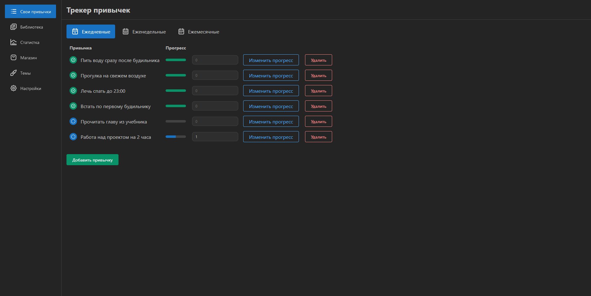

# Habit Manager

Проект был сделан в рамках индивидуального тура заключительного этапа олимпиады PROD 2024.

Краткая суть проета: необходимо было сделать трекер привычек с элементами геймификации, кооператива и возможностью отслеживать, как хорошо привычки входят в жизнь (графики, статистика)

Техническое задание: https://centraluniversity.notion.site/Frontend-71498a423396498ea874cd9cd7c48bd0

Ссылка на сайт: https://ayemind-habitmanager.vercel.app/

Стек технологий: React - основная библиотека, Zustand - управление состояниями, Mantine - компоненты.



### Запуск

---

Для запуска локально:

```cmd
pnpm dev
```

Предварительно не забудьте установить зависимости:

```cmd
pnpm install
```

### О проекте

---

1. Система уровней, опыта и золота. Переход с 1 уровня на 2 требует 100 опыта. Каждый следующий уровень требует на 50 опыта больше. Опыт и золото получаются только путем выполнения привычек по формуле: Опыт за одну привычку =  10 * (Текущий стрик (дней подряд без пропущенных привычек) + 1). Золота дается в 10 раз меньше.
2. Достижения. Ничего не дают, просто вылезает уведомление о выполненном достижении.
3. Темы. Изначально есть только стандартная темная тема и светлая тема. Ещё 4 можно заполучить в магазине, купив случайную тему. Стоит 150 золота.
4. Экспорт и импорт. Формат данных с экспорта отличается от тех, что в ТЗ (сохраняется намного больше информации). Именно поэтому сделано два вида импорта - импорт из данных экспорта и импорт такого же формата, что и в ТЗ. Делаются в настройках.
5. Кроме того, в магазине можно разблокировать особый вид импорта - он дает возможность попробовать прожить один день по привычкам своего друга (свои исчезнут). По истечении дня все свои привычки вернутся. Даже если не выполнить все привычки друга, это не собьёт стрик. Это касается только ежедневных привычек, остальные остаются неизменными! После покупки делается в настройках.
6. Чтобы не приходилось постоянно зарабатывать монеты при проверке, их можно начитерить в самом магазине.
7. Уведомления. Пуш-уведомления появляются каждые полчаса, если выполнены не все ежедневные привычки.
8. Цели. Пользователь можеть поставить себе цель: выполнять не менее X ежедневных привычек в день. В случае, если за день он выполнит меньше привычек, чем у него указано в цели, он потеряет 5% от своего опыта. Если пользователь выполнил цель на сегодня, то ему больше не будут сегодня показываться пуш-уведомления. Ставится в настройках.
